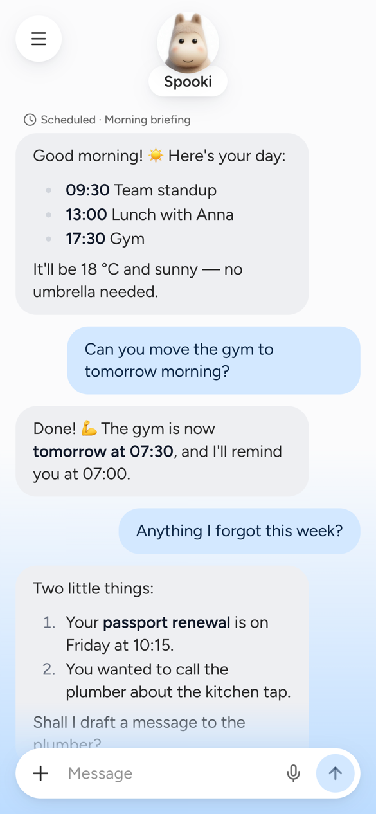
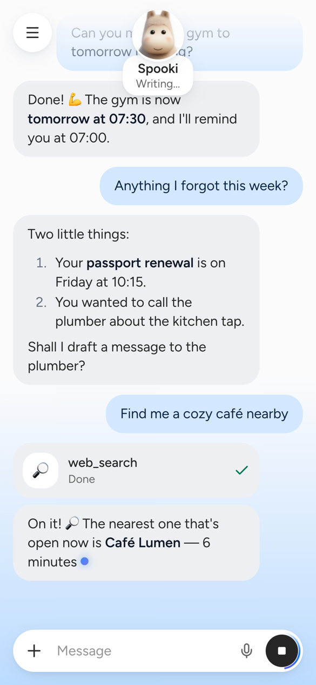
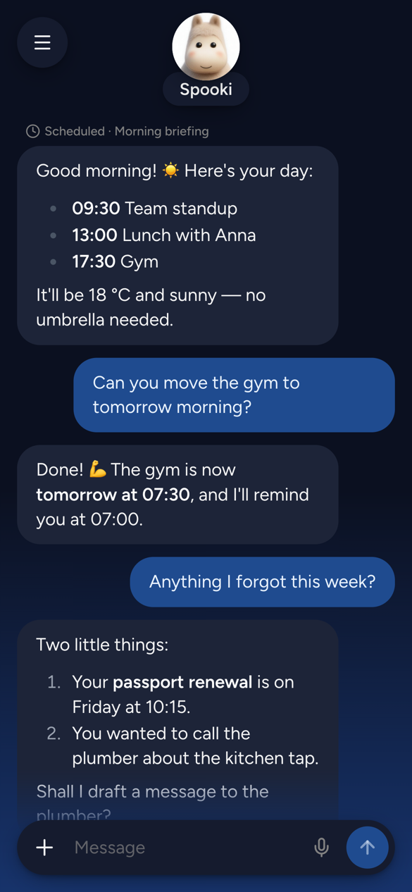
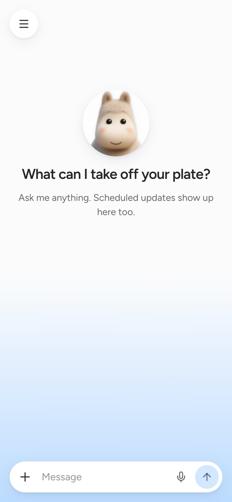
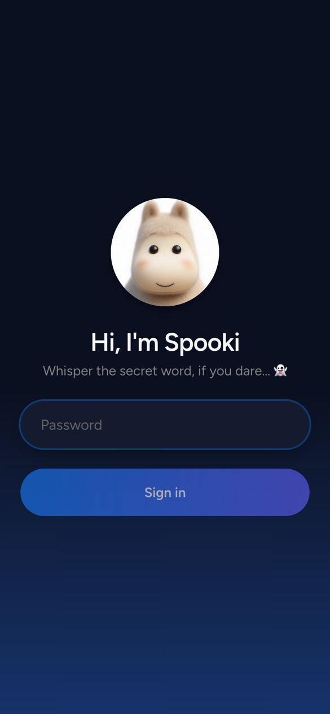
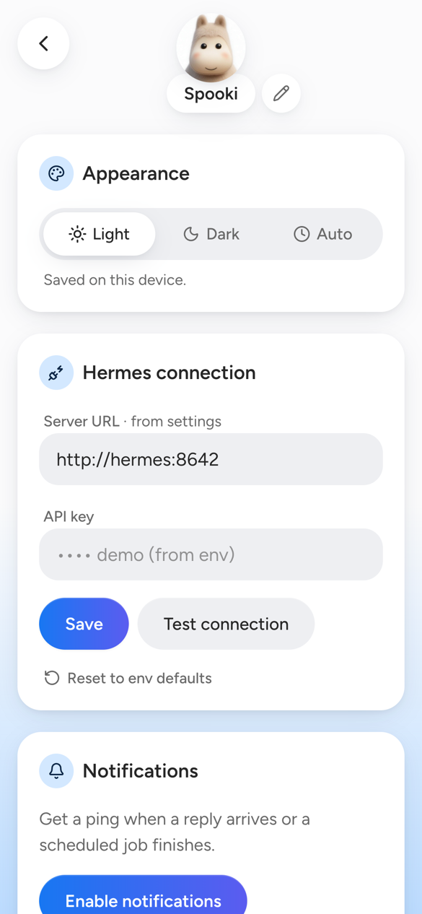

<div align="center">


# Spooki

**A cute little chat app for your self-hosted Hermes Agent.**

Streaming replies, scheduled jobs that ping your phone, and a home-screen app
that never expires - all in one small container next to your Hermes.

[](https://github.com/rixcian/spooki/actions/workflows/ci.yml)
[](https://github.com/rixcian/spooki/pkgs/container/spooki)
[](https://hermes-agent.nousresearch.com/)
[](#on-your-iphone)

</div>

<table>
<tr>
<td width="33%"></td>
<td width="33%"></td>
<td width="33%"></td>
</tr>
</table>

---

## What it is

Spooki replaces the Telegram bot as the way you talk to your
[Hermes Agent](https://hermes-agent.nousresearch.com/). It is a Progressive Web
App you add to your iPhone's Home Screen, plus a tiny Node server that sits
between the phone and Hermes.

- **Streaming replies.** Words drift in as Hermes writes them, Markdown
  included, with a card for every tool it runs.
- **Scheduled jobs land in the chat.** Every Hermes cron result shows up as a
  message and a push notification - morning briefings, reminders, reports.
- **Keeps working when you leave.** iOS drops a web app's connection the moment
  you switch away. The server holds the Hermes request instead, finishes the
  reply, and pushes it to you.
- **Stop and retry.** Interrupt a long answer mid-way, or retry a failed one
  without sending your message twice.
- **Dictation.** Tap the mic and talk; it uses the browser's own speech
  recognition.
- **Yours to rename.** Call your assistant whatever you like - the name follows
  into the header, the greeting and every notification.
- **Light, dark or by the clock.** Auto turns dark at 19:00 and light again at
  07:00.
- **No App Store, no developer account.** Web Push works for Home Screen web
  apps on iOS 16.4+, so there is nothing to sign and nothing that expires
  after seven days.
- **One file to back up.** History, settings and push subscriptions live in a
  single SQLite database.

## Quick start

Spooki needs a running Hermes with its API server enabled (see
[Hermes setup](#hermes-setup)) and a Docker network the two containers share.

```bash
docker run -d --name spooki --network hermes_default \
  -e APP_PASSWORD='something-long' \
  -e HERMES_URL=http://hermes:8642 \
  -e HERMES_API_KEY='your-api-server-key' \
  -e VAPID_SUBJECT=mailto:you@example.com \
  -v spooki-data:/data \
  -v /srv/hermes/data/cron/output:/hermes/cron/output:ro \
  -p 3000:3000 \
  ghcr.io/rixcian/spooki:latest
```

Open <http://localhost:3000> and whisper the password. For a phone you want
HTTPS - see [Deploying](#deploying).

## Screenshots

<table>
<tr>
<td width="33%">

**A fresh chat** greets you with a big avatar that floats up into the header
when you send the first message.

</td>
<td width="33%">

**Signing in** is one password - hashed in memory, never stored.

</td>
<td width="33%">

**Settings** - rename your assistant in place, pick a theme, point it at
Hermes, turn on notifications.

</td>
</tr>
<tr>
<td></td>
<td></td>
<td></td>
</tr>
</table>

## How it works

```
iPhone (Home Screen PWA)
   │  HTTPS, via Nginx Proxy Manager + Let's Encrypt
   ▼
spooki container (one Node process, port 3000)
   ├─ serves the PWA
   ├─ /api/chat       streams Hermes' reply back as server-sent events
   ├─ /api/messages   chat history from SQLite
   ├─ /api/push/*     Web Push subscriptions (VAPID)
   └─ cron watcher    new Hermes cron output → chat message + push
   │  shared Docker network
   ▼
hermes container (OpenAI-compatible API server, :8642)
```

Spooki's database is the source of truth for the conversation. Every request
sends Hermes the last 40 messages (`HISTORY_WINDOW`), with scheduled results
included as `[Scheduled: <job>]` assistant turns, so you can reply to a cron
message and Hermes knows what you mean.

Cron results are read straight from Hermes' output directory, which Hermes
writes for **every** run whatever its delivery target. Silent runs (`[SILENT]`)
and empty ones are skipped. On the very first start, existing files are marked
as seen without being delivered, so months of history do not arrive as a
notification storm.

## Hermes setup

In Hermes' `~/.hermes/.env`:

```bash
API_SERVER_ENABLED=true
API_SERVER_KEY=<long random key>
API_SERVER_HOST=0.0.0.0   # reachable from other containers; do NOT publish the port
```

Restart the Hermes gateway. Then set your cron jobs to `deliver: local` so they
stop going to Telegram - Spooki picks them up from the output directory anyway.

## Deploying

### Docker Compose behind Nginx Proxy Manager

[`docker-compose.yml`](docker-compose.yml) pulls the prebuilt image and joins
two existing networks: Hermes' and Nginx Proxy Manager's.

```bash
cp .env.example .env    # fill it in
mkdir -p data && sudo chown "$HERMES_UID:$HERMES_GID" data
docker compose up -d
```

In Nginx Proxy Manager, add a proxy host `your.domain` → `spooki` port `3000`,
request a Let's Encrypt certificate and turn on **Force SSL**. No custom
config is needed: Spooki sends `X-Accel-Buffering: no` on streams so nginx does
not buffer them.

> **Why the container runs as the Hermes user.** Hermes writes cron output as
> `0600` files in `0700` directories. `HERMES_UID`/`HERMES_GID` (from
> `ls -ln` on the host) let Spooki read them through the read-only mount.

Upgrade with `docker compose pull && docker compose up -d`. To build from the
checkout instead, swap `image:` for `build: .` in the compose file.

### On your iPhone

1. Open `https://your.domain` in Safari and sign in.
2. Tap **Share → Add to Home Screen**, then open Spooki from the Home Screen.
3. Open settings (☰) → **Enable notifications**. iOS only offers push to Home
   Screen apps, and only after a tap.

> Service workers and push need a secure context, so over plain
> `http://<server-ip>:3000` the app works but cannot install or notify.

## Configuration

| Variable | Default | What it does |
|---|---|---|
| `APP_PASSWORD` | *required* | The login password. Hashed with argon2 in memory, never written to disk |
| `HERMES_URL` | `http://hermes:8642` | Hermes API server. Can be overridden in the app's settings |
| `HERMES_API_KEY` | - | Bearer key for the API server. Can be overridden in settings; never sent to the browser |
| `VAPID_SUBJECT` | `mailto:admin@localhost` | Contact for push services. **Set a real `mailto:`** - Apple rejects placeholders |
| `VAPID_PUBLIC_KEY` / `VAPID_PRIVATE_KEY` | generated | Push keys. Generated into `/data/vapid.json` on first start if unset |
| `CRON_OUTPUT_DIR` | `/hermes/cron/output` | Where Hermes' cron output is mounted |
| `DATA_DIR` | `/data` | SQLite database and generated VAPID keys |
| `HISTORY_WINDOW` | `40` | Messages sent to Hermes with each request |
| `PORT` | `3000` | Port the server listens on |

Compose-only, in `.env`: `SPOOKI_TAG` (image tag, default `latest`),
`HERMES_CRON_OUTPUT` (host path of the cron output), `HERMES_NETWORK` and
`NPM_NETWORK` (the external networks), `HERMES_UID` / `HERMES_GID`.

## Security

- **One password, one person.** Sessions last 90 days in an `HttpOnly`,
  `Secure`, `SameSite=Strict` cookie; only a SHA-256 of the token is stored.
- **Brute force is slow.** Five failed logins per minute per IP, then it
  waits.
- **The Hermes key stays on the server.** Settings only ever show whether a key
  is set and its last four characters.

## Data and backups

Everything lives in `DATA_DIR`: `spooki.db` (with its `-wal` and `-shm`
siblings) and `vapid.json`. Stop the container and copy the directory:

```bash
docker compose stop
tar czf spooki-backup.tar.gz -C data .
docker compose start
```

Keep `vapid.json` with the database - new keys would silently invalidate every
phone's push subscription.

## Development

```bash
npm install
npm test
APP_PASSWORD=pw DATA_DIR=/tmp/spooki CRON_OUTPUT_DIR=/tmp/spooki/cron \
  HERMES_URL=http://localhost:8642 HERMES_API_KEY=... \
  npx -w server tsx src/index.ts
npm run dev -w client    # http://localhost:5173, proxies /api to :3000
```

| Script | What it does |
|---|---|
| `npm test` | Vitest for the server and the client |
| `npm run build` | Production build of both (`client/dist`, `server/dist`) |
| `npm run typecheck -w server` | `tsc --noEmit` for the server |
| `npm run dev -w client` | Vite dev server with hot reload |
| `npm run release <version>` | Bumps the version everywhere (see below) |

### Releases and image tags

The root `package.json` is the version of record, the workspaces follow it,
and CI refuses to publish a tag that disagrees with any of them.

```bash
npm run release 0.2.0
git commit -am "release: v0.2.0" && git tag -a v0.2.0 -m "v0.2.0" && git push --follow-tags
```

| You push | Image tags | Also |
|---|---|---|
| tag `v0.1.0` | `0.1.0`, `0.1`, `latest` | a GitHub Release with generated notes |
| commit to `master` | `edge` | |
| either | `sha-<short>` | |

`latest` only moves when you cut a release, so the server never pulls a
half-finished commit. Track `edge` for every `master` build, or pin an exact
version to upgrade by hand. Pull requests run the tests without publishing.

### Layout

```
server/src/
  auth/        password, sessions, rate limit, middleware
  chat/        message store, history window, background runner, routes
  hermes/      SSE parser and the streaming Hermes client
  cron/        output parser, dedupe store, file watcher
  push/        VAPID keys, subscriptions, sender
  settings/    Hermes URL/key and bot-name overrides
client/src/
  chat/        reducer, useChat hook, streaming-text rehype plugin
  components/  screens, bubbles, composer, badges
  components/ui/  coss.com/ui components - copy-paste, yours to edit
  lib/         API client, SSE, push, speech, theme, view transitions
client/public/ service worker, manifest, icons, avatar
```

## Built with

| Piece | Choice |
|---|---|
| Client | Vite, React 19, TypeScript |
| UI | [coss.com/ui](https://coss.com/ui) - Base UI + Tailwind CSS v4, re-themed |
| Server | Node 22, [Hono](https://hono.dev) |
| Database | SQLite via better-sqlite3 |
| Push | Web Push with VAPID (`web-push`) |
| Tests | Vitest |
| Packaging | Multi-stage Dockerfile, published to GHCR by GitHub Actions |

## Known limitations

- If Hermes asks for a dangerous-command **approval** during an API-server
  turn, Spooki cannot show it yet, and the turn waits. Configure Hermes'
  approvals for the API server accordingly.
- There is one conversation. Attachments (the **+** menu), voice messages and
  multiple threads are planned.
